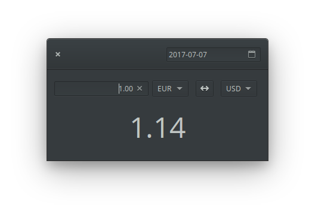

# Exchange
## Convert currencies with no hassle


## Install it from elementary's appcenter
[](https://appcenter.elementary.io/com.github.brandonlujan.exchange.desktop)



## Consider donating me to keep on making good content for elementary OS

### Via Bitcoin:


Bitcoin Address: 1H4vEtWSpsW52vxijK6EqDrfq4Lo1wQ7hE

## Via PayPal
[](https://www.paypal.me/brandonluar)

## To build:

Clone this repo, then:

```
$ meson build && cd build
$ mesonconf -Dprefix=/usr
$ sudo ninja install
```